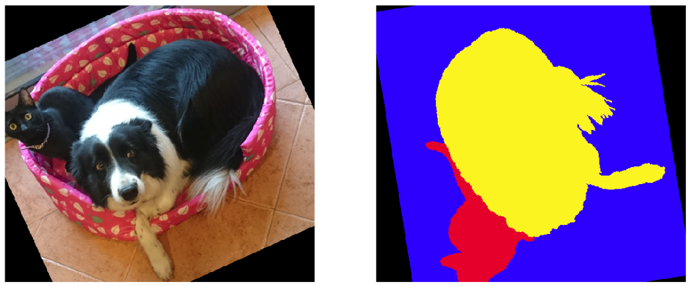

# Paired Transforms in `torchvision`

Extension of `torchvision` transforms to handle simultaneous transformation of input and ground-truth when the latter is 
an image.

**Note:** Extensions for `PyTorch` `0.3` and `0.4` are provided in separate files.


When performing data augmentation in dense pixel-wise prediction tasks we typically want to transform in exactly the same 
way the input image and the ground-truth. The [recommended way](https://github.com/pytorch/vision/releases/tag/v0.2.0) 
for dealing with this requires to handle these paired transforms in the training part of your code.

The files `paired_transforms_pt03.py` and `paired_transforms_pt04.py` in this repo contains suitably modified classes 
so that the user does not need to take care of this:
* If a transform is called with two inputs it will transform both in the same way automatically. 
* If a transform is called with only one input, the behavior of the several classes will 
 be preserved wrt to the original implementation. 
 
This means that you can use this as a plug-and-play extension, *e.g.* replacing:
 
 `import torchvision.transforms as tr`
 
 by:
 
 `import paired_ransforms_pt04 as tr`
 
 Please see the notebooks `paired_transforms_pytorch0.3.ipynb` and `paired_transforms_pytorch0.4.ipynb` for an example of 
 how the original implementation was modified, and `paired_transforms_examples_pytorch0.3.ipynb`, 
 `paired_transforms_examples_pytorch0.4.ipynb` for examples of all the transforms that were modified. I am also including 
an example of how to build a `PyTorch` dataset and dataloader using paired transforms.
 Below you can find a visual example.
 
---------------------------------------

Retinal Image and associated ground-truth, useful for the task of classifying retinal 
vessels into arteries and veins:


Result of transforming them with standard `torchvision` code:
```
from torchvision import transforms as tr
degrees=(0,180)
rotate = tr.RandomRotation(degrees)
rotated_im = rotate(image)
rotated_gt = rotate(gdt)
imshow_pair(rotated_im, rotated_gt)
```


Result of transforming them with extended transforms:
```
import paired_ransforms_pt04 as tr
rotate = tr.RandomRotation(degrees)
rotated_pair = rotate(image, gdt)
imshow_pair(*rotated_pair)
```


Have fun!


